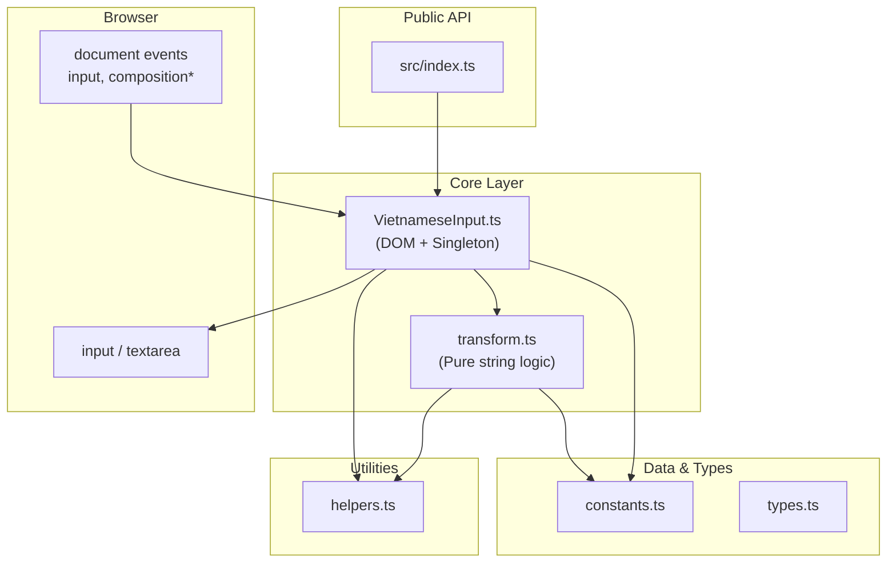
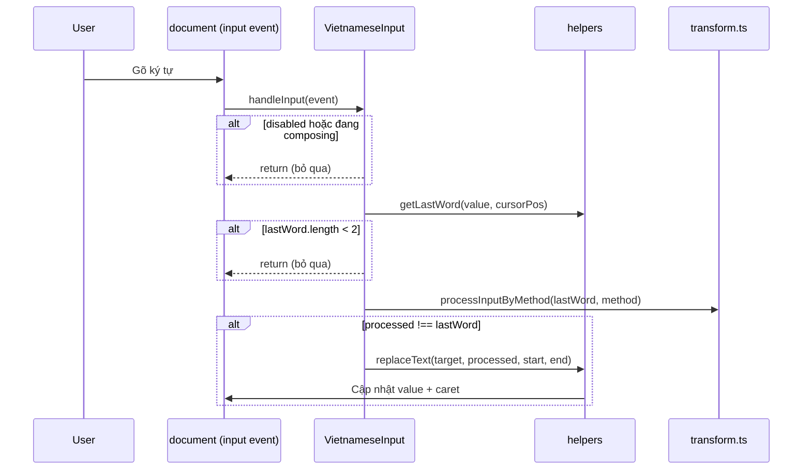

# Kiến trúc hệ thống

## Tổng quan kiến trúc

gotiengviet-js tuân theo kiến trúc **phân tầng đơn giản** với tách biệt rõ ràng giữa xử lý DOM và logic chuyển đổi chuỗi thuần (pure functions).



## Các thành phần chính

### 1. Entry Point — `src/index.ts`

Điểm xuất công khai duy nhất. Chỉ export:

- `VietnameseInput` — class chính
- `InputConfig`, `InputMethod` — kiểu dữ liệu công khai

Người dùng **không nên** import trực tiếp từ `src/core/` hay `src/utils/`.

### 2. VietnameseInput — `src/core/VietnameseInput.ts`

**Trách nhiệm:**

- Quản lý singleton (`getInstance`, `destroyInstance`)
- Gắn/bỏ event listener trên `document`
- Điều phối luồng xử lý khi người dùng gõ
- API runtime: `enable`, `disable`, `toggle`, `setInputMethod`, `getInputMethod`

**Pattern:** Singleton — khuyến nghị một instance duy nhất trên mỗi trang.

### 3. Transform Engine — `src/core/transform.ts`

**Trách nhiệm:**

- `processInputByMethod(text, method)` — chuyển đổi chuỗi theo quy tắc bộ gõ
- `applyToneToText(text, toneIndex)` — áp dấu thanh lên nguyên âm đúng vị trí

**Nguyên tắc:** Không có side effect, không truy cập DOM. Dễ unit test độc lập.

### 4. Constants — `src/constants.ts`

Chứa dữ liệu tĩnh:

- `VIETNAMESE_CHARS` — bảng ánh xạ nguyên âm → 6 dạng có dấu thanh
- `INPUT_METHODS` — quy tắc `toneRules` và `markRules` cho Telex, VNI, VIQR
- `DEFAULT_CONFIG` — cấu hình mặc định

### 5. Utilities — `src/utils/helpers.ts`

| Hàm | Mục đích |
|-----|----------|
| `getLastWord(value, position)` | Trích từ cuối tại vị trí con trỏ |
| `findVowelPosition(text)` | Tìm vị trí các nguyên âm |
| `replaceText(element, newText, start, end)` | Thay thế đoạn text, giữ vị trí con trỏ |
| `isVietnameseWord(text)` | Kiểm tra chuỗi chỉ chứa ký tự tiếng Việt |
| `shouldRestoreNonViet(text)` | Phát hiện email, URL, tên biến |

Tài liệu luồng nghiệp vụ chi tiết (11 flow + sơ đồ): [business-flows.md](./business-flows.md).

## Luồng xử lý sự kiện



## Thuật toán chuyển đổi

`processInputByMethod` thực hiện theo thứ tự:

1. **Xử lý dấu thanh (tone rules)** — quét từng ký tự, tìm phím dấu (s/f/r/x/j/z cho Telex), áp dấu lên nguyên âm bên trái
2. **Xử lý dấu mũ/ký tự đặc biệt (mark rules)** — thay thế chuỗi (aa→â, dd→đ, ...) theo thứ tự key dài nhất trước
3. **Chuẩn hóa** — ghép `u` + `ơ` → `ươ`

### Ưu tiên dấu thanh

Khi một từ có nhiều nguyên âm, `applyToneToText` chọn nguyên âm theo thứ tự ưu tiên:

```
a > ă > â > o > ô > ơ > e > ê > u > ư > i > y
```

Ví dụ: `hoaf` → dấu sắc đặt lên `o` trong `hoa` → `hóa`.

## Mô hình Singleton

```typescript
// Khuyến nghị
const vi = VietnameseInput.getInstance({ inputMethod: 'telex' });

// Cleanup (SPA navigation, testing)
VietnameseInput.destroyInstance();
```

Singleton đảm bảo chỉ một bộ listener trên `document`, tránh duplicate event handler khi nhiều component khởi tạo.

## Build Artifacts

Rollup tạo hai output từ `src/index.ts`:

| File | Format | Mục đích |
|------|--------|----------|
| `dist/index.js` | UMD (`GoTiengViet`) | Trình duyệt, script tag |
| `dist/index.esm.js` | ESM | Webpack, Vite, Rollup |
| `dist/index.d.ts` | TypeScript declarations | IntelliSense |

## Ràng buộc thiết kế

1. **Zero runtime dependency** — không thêm package production
2. **Pure transform** — logic chuyển đổi tách khỏi DOM
3. **Global listener** — một listener trên `document`, không cần gắn từng element
4. **Backwards compatibility** — `processInput` và `applyTone` vẫn public cho test/legacy

## Điểm mở rộng trong tương lai

- Hỗ trợ `contenteditable`
- Bộ gõ tùy chỉnh qua config
- Scope listener theo container thay vì toàn `document`
- Plugin hook trước/sau transform
