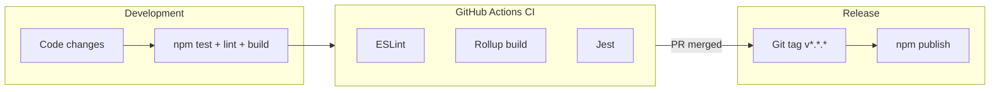

# Build & Phát hành

## Quy trình Build

### Lệnh build

```bash
npm run build
```

Thực hiện:

1. `rimraf dist` — xóa artifacts cũ
2. `rollup -c` — build từ `src/index.ts`

### Output

| Artifact | Format | Entry trong package.json |
|----------|--------|--------------------------|
| `dist/index.js` | UMD | `"main"` |
| `dist/index.esm.js` | ESM | `"module"` |
| `dist/index.d.ts` | TypeScript declarations | `"types"` |
| `dist/*.map` | Source maps | — |

### Rollup config

File `rollup.config.js` tạo hai bundle:

```javascript
// UMD — trình duyệt, global GoTiengViet
{ format: 'umd', file: 'dist/index.js', name: 'GoTiengViet' }

// ESM — bundler hiện đại
{ format: 'es', file: 'dist/index.esm.js' }
```

Plugins: `@rollup/plugin-typescript`, `@rollup/plugin-node-resolve`, `@rollup/plugin-commonjs`.

### TypeScript compilation

`tsconfig.json`:

- `declaration: true` → tạo `.d.ts`
- `declarationDir: ./dist`
- `target: es2018`
- Exclude test files khỏi build

## Files được publish

Theo `package.json` → `"files"`:

```
dist/
LICENSE
README.md
```

`README.md` ở root chỉ trỏ tới `docs/`. Các file khác (source, docs, tests) **không** được đưa lên npm.

## CI/CD

### Continuous Integration

Workflow: `.github/workflows/ci.yml`

**Trigger:** push/PR vào `main`

**Matrix:** Node.js 16.x, 18.x, 20.x

**Steps:**

```
checkout → setup-node → npm ci → lint → build → test
```

### Publish to npm

Workflow: `.github/workflows/publish.yml`

**Trigger:** push tag `v*.*.*` (ví dụ `v1.0.1`)

**Steps:**

```
checkout → setup-node → npm ci → lint → test → build → npm publish
```

**Yêu cầu:** Secret `NPM_TOKEN` trong GitHub repository settings.

## GitFlow và release

Feature tích hợp trên `develop` trước khi release. Xem [gitflow.md](./gitflow.md).

```
feature/* → develop → release/* → main (tag v*.*.*)
```

## Quy trình phát hành

### 1. Tạo nhánh release

```bash
git checkout develop
git pull origin develop
git checkout -b release/1.0.1
npm run lint && npm test && npm run build
```

### 2. Cập nhật Changelog

Cập nhật [docs/changelog.md](./changelog.md) theo [Keep a Changelog](https://keepachangelog.com/):

```markdown
## [1.0.1] - 2025-06-08

### Fixed
- Mô tả bug fix

### Added
- Mô tả tính năng mới
```

### 3. Bump version

```bash
npm version patch   # 1.0.0 → 1.0.1
# hoặc
npm version minor   # 1.0.0 → 1.1.0
# hoặc
npm version major   # 1.0.0 → 2.0.0
```

Tuân theo [Semantic Versioning](https://semver.org/):

| Loại | Khi nào |
|------|---------|
| MAJOR | Breaking change API |
| MINOR | Tính năng mới, tương thích ngược |
| PATCH | Bug fix, tương thích ngược |

### 4. Push tag

```bash
git push origin main
git push origin v1.0.1
```

GitHub Actions tự publish lên npm registry.

### 5. Xác nhận

```bash
npm view gotiengviet version
```

## Pre-publish hooks

| Hook | Lệnh | Mô tả |
|------|------|-------|
| `prepare` | `npm run build` | Build sau install |
| `prepublishOnly` | `npm test && npm run lint` | Gate trước publish |

## Kiểm tra package local

```bash
# Build
npm run build

# Pack tarball
npm pack

# Cài trong dự án test
cd ../my-test-app
npm install ../gotiengviet-js/gotiengviet-1.0.0.tgz
```

## Troubleshooting

### Build fail — TypeScript error

```bash
npx tsc --noEmit
```

### Publish fail — version đã tồn tại

Bump version mới, không publish lại cùng version.

### CI fail trên Node matrix

Kiểm tra compatibility — dự án target ES2018, nên chạy trên Node 14+.

## Sơ đồ pipeline


