# Luồng nghiệp vụ (Business Flows)

Tài liệu mô tả chi tiết các **luồng nghiệp vụ** của gotiengviet-js — từ góc nhìn người dùng cuối, runtime, thuật toán chuyển đổi, và quy trình phát triển/phát hành.

Mỗi luồng kèm **sơ đồ Mermaid** để dễ đọc và bảo trì.

## Mục lục luồng

| # | Luồng | Đối tượng |
|---|-------|-----------|
| 1 | [Tích hợp thư viện](#1-luồng-tích-hợp-thư-viện) | Developer |
| 2 | [Gõ tiếng Việt (runtime)](#2-luồng-gõ-tiếng-việt-runtime) | End user |
| 3 | [Vòng đời Singleton](#3-luồng-vòng-đời-singleton) | Runtime |
| 4 | [IME Composition](#4-luồng-ime-composition) | Runtime |
| 5 | [Pipeline chuyển đổi ký tự](#5-luồng-pipeline-chuyển-đổi-ký-tự) | Thuật toán |
| 6 | [Áp dấu thanh](#6-luồng-áp-dấu-thanh) | Thuật toán |
| 7 | [Thay thế text trên DOM](#7-luồng-thay-thế-text-trên-dom) | Runtime |
| 8 | [Đổi bộ gõ runtime](#8-luồng-đổi-bộ-gõ-runtime) | End user / Developer |
| 9 | [Phát triển feature](#9-luồng-phát-triển-feature) | Contributor |
| 10 | [GitFlow & phát hành](#10-luồng-gitflow--phát-hành) | Maintainer |
| 11 | [CI/CD](#11-luồng-cicd) | Hệ thống |

---

## 1. Luồng tích hợp thư viện

Developer tích hợp gotiengviet vào ứng dụng web.

```mermaid
flowchart TD
    A[Cài đặt npm install gotiengviet] --> B[Import VietnameseInput]
    B --> C{Framework?}
    C -->|React| D[useEffect → getInstance]
    C -->|Vue| E[onMounted → getInstance]
    C -->|Angular| F[ngOnInit → getInstance]
    C -->|Plain JS| G[getInstance trực tiếp]
    D --> H[Cấu hình InputConfig]
    E --> H
    F --> H
    G --> H
    H --> I{enabled: true?}
    I -->|Có| J[Lắng nghe input trên document]
    I -->|Không| K[Listener active nhưng bỏ qua transform]
    J --> L[User gõ tiếng Việt trên input/textarea]
    K --> M[Có thể enable() sau]
    L --> N{SPA unmount?}
    M --> N
    N -->|Có| O[destroyInstance]
    N -->|Không| L
```

### Các bước chi tiết

| Bước | Hành động | API |
|------|-----------|-----|
| 1 | Cài package | `npm install gotiengviet` |
| 2 | Khởi tạo singleton | `VietnameseInput.getInstance(config)` |
| 3 | Tùy chọn đổi bộ gõ | `setInputMethod('telex' \| 'vni' \| 'viqr')` |
| 4 | Tùy chọn bật/tắt | `enable()` / `disable()` / `toggle()` |
| 5 | Cleanup khi rời trang | `VietnameseInput.destroyInstance()` |

Chi tiết code: [getting-started.md](./getting-started.md).

---

## 2. Luồng gõ tiếng Việt (runtime)

Luồng nghiệp vụ chính khi người dùng gõ trên `<input>` hoặc `<textarea>`.

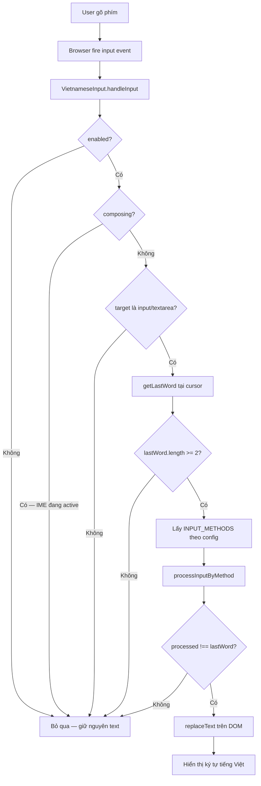

### Ví dụ luồng (Telex)

```
User gõ: h → o → a → s
         │   │   │   └── tone key 's' → sắc
         │   │   └────── nguyên âm 'a'
         └───┴────────── từ "hoas"

processInputByMethod("hoas", telex) → "hóa"
replaceText: "hoas" → "hóa" tại vị trí từ cuối
```

### Điều kiện bỏ qua transform

| Điều kiện | Lý do nghiệp vụ |
|-----------|-----------------|
| `enabled = false` | User/dev tắt gõ tiếng Việt |
| `composing = true` | Tránh xung đột bộ gõ hệ thống (IME) |
| `lastWord.length < 2` | Chưa đủ ký tự để nhận diện từ |
| `processed === lastWord` | Không có thay đổi — không cập nhật DOM |

---

## 3. Luồng vòng đời Singleton

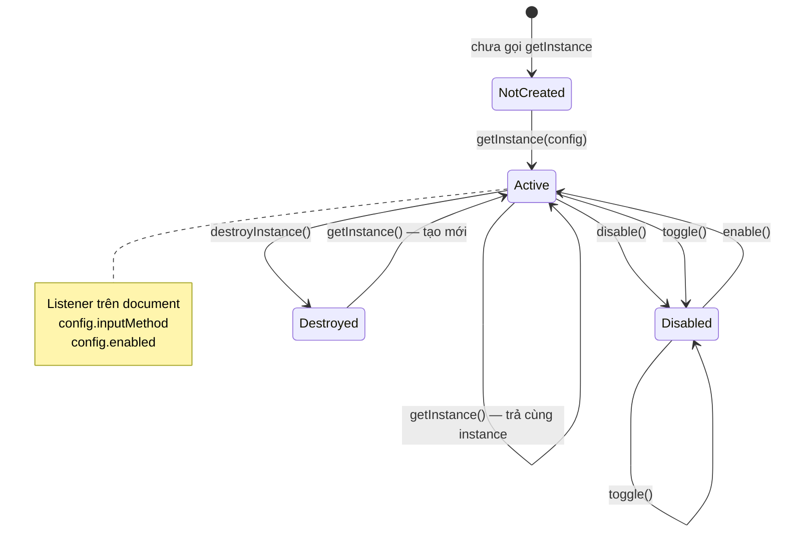

### Quy tắc nghiệp vụ

- **Một instance** trên mỗi trang — tránh duplicate listener
- `getInstance()` lần 2+ **không** áp dụng config mới
- `destroyInstance()` gỡ listener — bắt buộc khi unmount SPA
- `destroy()` chỉ gỡ listener, không reset `_instance`

---

## 4. Luồng IME Composition

Xử lý khi bộ gõ hệ điều hành (IME) đang hoạt động.

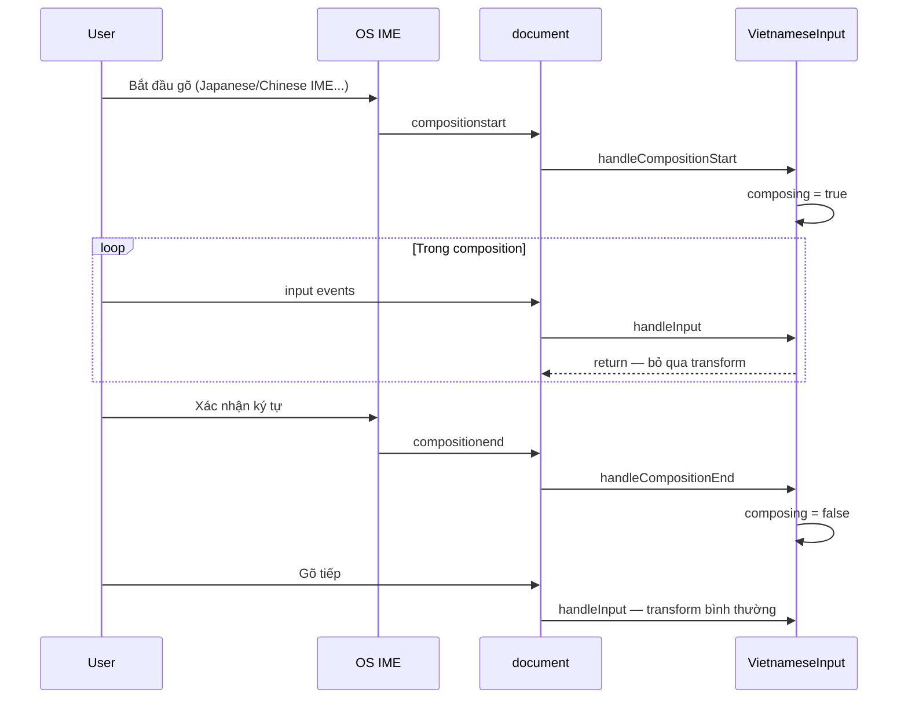

---

## 5. Luồng pipeline chuyển đổi ký tự

`processInputByMethod` — engine xử lý chuỗi thuần.

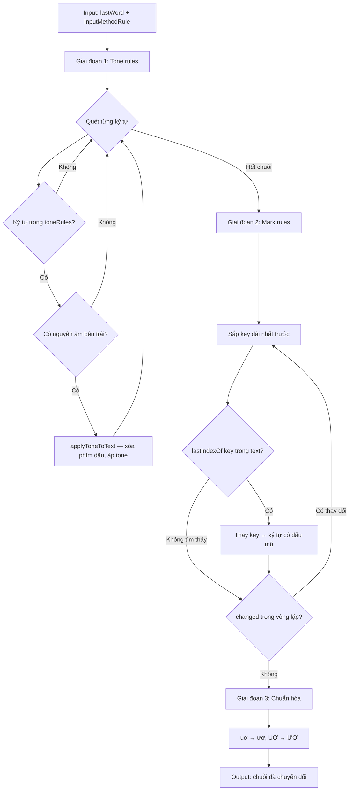

### Thứ tự xử lý (không đổi)

1. **Tone** — phím dấu thanh (s/f/r/x/j/z cho Telex)
2. **Mark** — chuỗi dấu mũ (aa→â, dd→đ, ...)
3. **Normalize** — ghép nguyên âm đặc biệt

Chi tiết quy tắc: [input-methods.md](./input-methods.md).

---

## 6. Luồng áp dấu thanh

`applyToneToText` — chọn nguyên âm nhận dấu thanh.

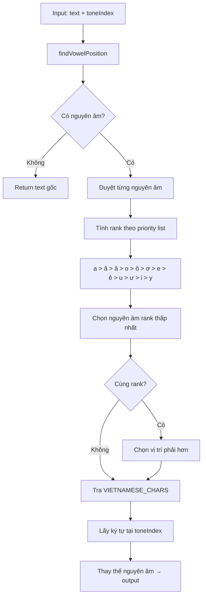

### Ví dụ nghiệp vụ

| Input (Telex) | Nguyên âm được chọn | Output |
|---------------|---------------------|--------|
| `hoas` (s=sắc) | `o` trong `hoa` | `hóa` |
| `nguoiwf` (f=huyền) | `u` trong `uoi` | `người` |
| `bas` (s=sắc) | `a` | `bá` |
| `xi` + `x` tone | Không áp (không có vowel trái `x`) | `xi` |

---

## 7. Luồng thay thế text trên DOM

`replaceText` — cập nhật giá trị input mà giữ con trỏ.

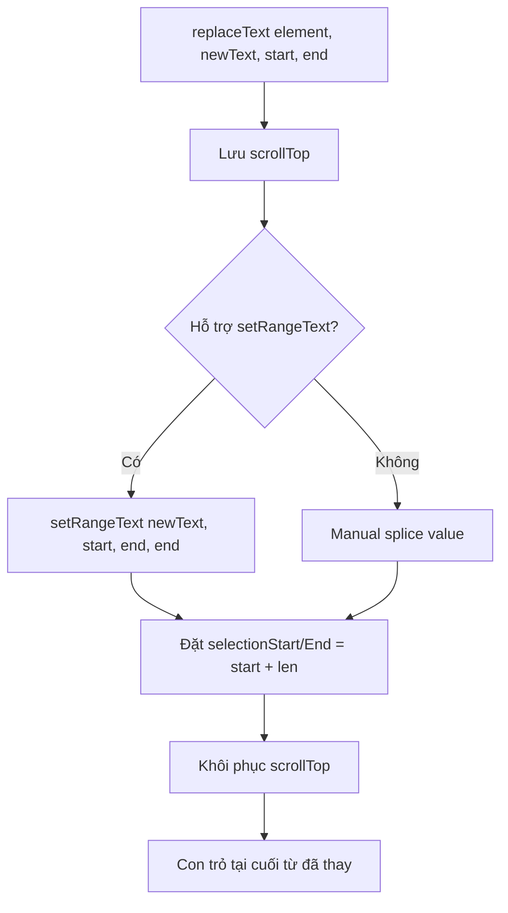

### Phạm vi thay thế

Chỉ thay **từ cuối** tại vị trí con trỏ — không ảnh hưởng phần text trước đó.

```
value: "Xin chao ban "
cursor: ───────────────^
lastWord: "ban" → transform → "bạn"
result: "Xin chao bạn"
```

---

## 8. Luồng đổi bộ gõ runtime

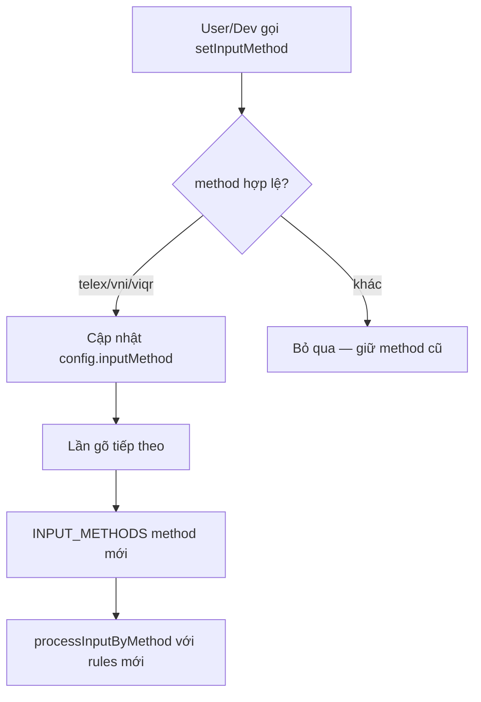

### Ba bộ gõ

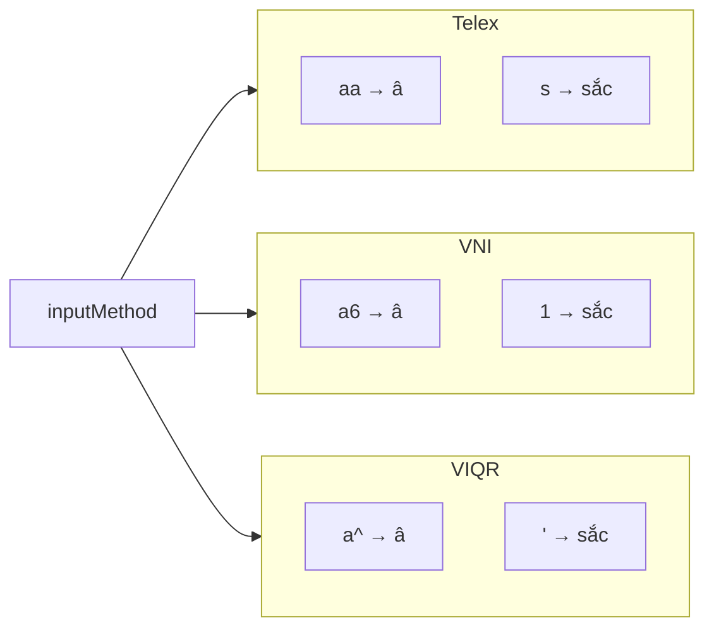

---

## 9. Luồng phát triển feature

Contributor implement tính năng mới — merge trực tiếp `develop`, không PR.

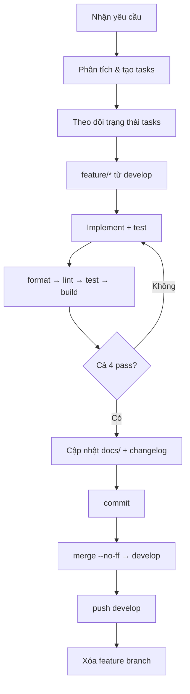

Chi tiết: [feature-workflow.md](./feature-workflow.md).

---

## 10. Luồng GitFlow & phát hành

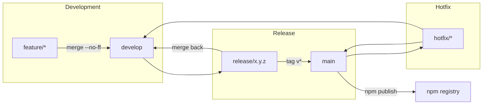

| Nhánh | Mục đích | Merge |
|-------|----------|-------|
| `feature/*` | Tính năng mới | → `develop` (không PR) |
| `release/*` | Chuẩn bị version | → `main` + `develop` |
| `hotfix/*` | Sửa production khẩn | → `main` + `develop` |

Chi tiết: [gitflow.md](./gitflow.md), [build-and-release.md](./build-and-release.md).

---

## 11. Luồng CI/CD

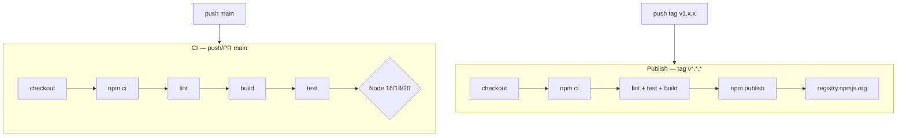

### Quality gate (local = CI)

```bash
npm run format && npm run lint && npm test && npm run build
```

---

## Sơ đồ tổng hợp hệ thống

Toàn cảnh các luồng nghiệp vụ chính trong một view:

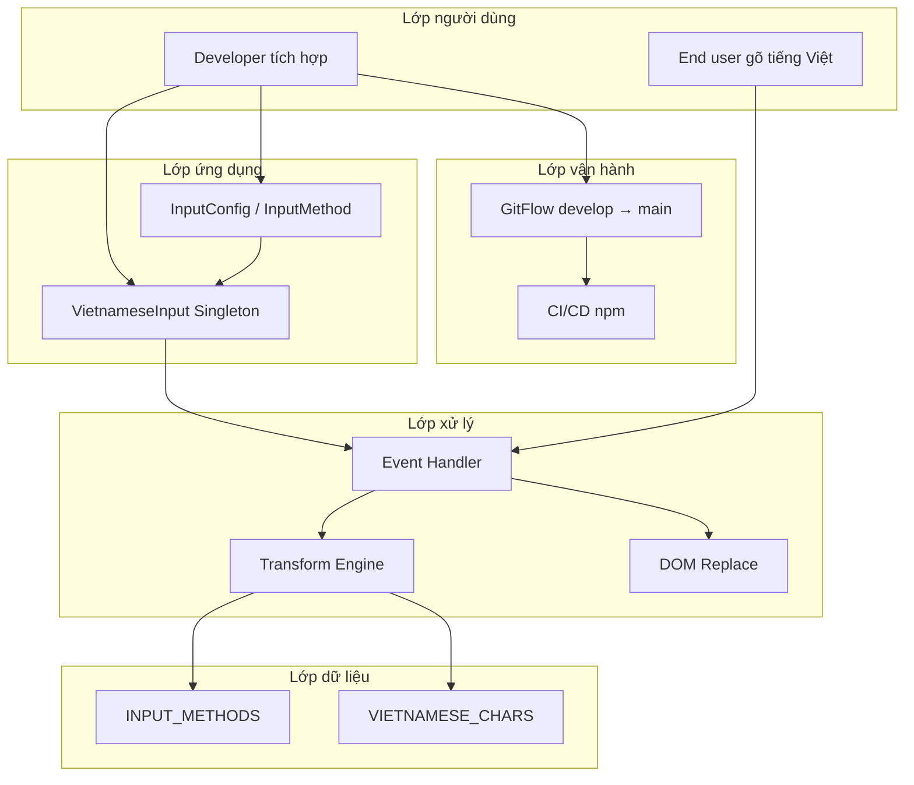

---

## Tài liệu liên quan

| Tài liệu | Nội dung |
|----------|----------|
| [architecture.md](./architecture.md) | Kiến trúc kỹ thuật, component diagram |
| [input-methods.md](./input-methods.md) | Bảng quy tắc bộ gõ |
| [api-reference.md](./api-reference.md) | API công khai |
| [feature-workflow.md](./feature-workflow.md) | Workflow implement feature |
| [gitflow.md](./gitflow.md) | Mô hình nhánh |
