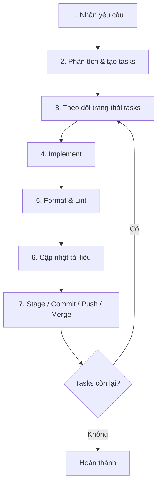
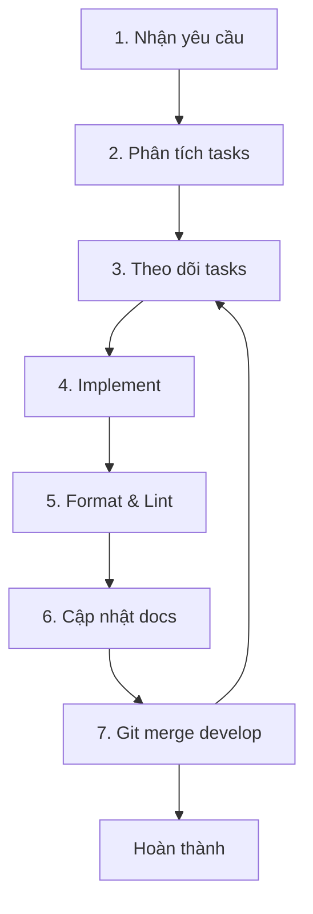

# Workflow: Implement Feature Task

Quy trình **tự động end-to-end** để nhận yêu cầu, phân rã task, implement, kiểm tra chất lượng, cập nhật tài liệu và merge vào `develop` theo GitFlow — **không tạo Pull Request**.

Áp dụng cho developer hoặc AI agent (Cursor) khi được giao một feature task.

## Cursor skills

Mỗi bước có skill riêng. Orchestrator: `implement-feature-task`.

| Bước | Skill |
|------|-------|
| Toàn bộ | `implement-feature-task` |
| 1. Nhận yêu cầu | `receive-feature-requirement` |
| 2. Phân tích tasks | `analyze-feature-tasks` |
| 3. Theo dõi tasks | `track-feature-tasks` |
| 4. Implement | `implement-feature-code` |
| 5. Format & lint | `run-quality-gate` |
| 6. Cập nhật docs | `sync-feature-docs` |
| 7. Git merge | `gitflow-feature-merge` |
| Audit toàn bộ docs | `maintain-docs` |

Index: [.cursor/skills/README.md](../.cursor/skills/README.md)

## Sơ đồ tổng quan



## Nguyên tắc

| Nguyên tắc | Mô tả |
|------------|-------|
| Tự chủ | Mỗi bước thực hiện đầy đủ, không dừng chờ review |
| Một task một mục đích | Mỗi task nhỏ, có thể verify độc lập |
| Không merge khi fail | Quality gate phải pass trước mọi commit/merge |
| Không PR | Merge trực tiếp `feature/*` → `develop` bằng `--no-ff` |
| Docs đồng bộ | Mọi thay đổi code phải phản ánh trong `docs/` |

---

## Bước 1: Nhận yêu cầu

### Input

Yêu cầu có thể đến từ:

- Issue GitHub (feature request)
- Mô tả trực tiếp từ người dùng / product owner
- Bug report cần xử lý như feature fix

### Hành động

1. Đọc và ghi lại **mục tiêu**, **phạm vi**, **ràng buộc**
2. Xác định loại thay đổi: `feat` / `fix` / `refactor` / `docs`
3. Kiểm tra xem yêu cầu có nằm ngoài [phạm vi dự án](./overview.md#phạm-vi-scope) không

### Output

```markdown
## Yêu cầu
- Mục tiêu: ...
- Phạm vi: trong / ngoài dự án
- Loại: feat | fix | refactor
- Nhánh dự kiến: feature/<ten-ngan>
```

---

## Bước 2: Phân tích yêu cầu và tạo tasks

### Hành động

1. Khảo sát codebase liên quan (`src/`, `docs/`, tests hiện có)
2. Phân rã yêu cầu thành **tasks nhỏ, tuần tự**
3. Gán mỗi task: mô tả, file ảnh hưởng, tiêu chí hoàn thành

### Mẫu phân rã task

| # | Task | File | Tiêu chí done |
|---|------|------|---------------|
| 1 | Tạo feature branch | git | Branch `feature/xxx` từ `develop` |
| 2 | Thêm/sửa logic | `src/core/transform.ts` | Test pass |
| 3 | Thêm test | `src/__tests__/` | Coverage case mới |
| 4 | Cập nhật API docs | `docs/api-reference.md` | Khớp code |
| 5 | Format & lint | — | `npm run lint` pass |
| 6 | Quality gate | — | lint + test + build pass |
| 7 | Commit & merge | git | Trên `develop`, branch đã xóa |

### Quy tắc tạo task

- Task đầu tiên luôn là **chuẩn bị Git** (checkout `develop`, tạo branch)
- Mỗi thay đổi logic có task **test** đi kèm
- Mỗi thay đổi public API có task **docs** đi kèm
- Task cuối luôn là **GitFlow merge**

### Output

Danh sách tasks với trạng thái ban đầu `pending`.

---

## Bước 3: Tự theo dõi và cập nhật trạng thái tasks

### Trạng thái

| Trạng thái | Ý nghĩa |
|------------|---------|
| `pending` | Chưa bắt đầu |
| `in_progress` | Đang thực hiện (chỉ **một** task tại một thời điểm) |
| `completed` | Xong, đã verify |
| `cancelled` | Không cần thực hiện (ghi lý do) |

### Quy tắc cập nhật

1. **Trước khi làm:** đánh dấu task → `in_progress`
2. **Sau khi xong:** đánh dấu → `completed` ngay lập tức
3. **Không** để nhiều task `in_progress` cùng lúc
4. **Không** để task `completed` khi chưa verify (test/lint)

### Công cụ (AI agent / Cursor)

Dùng todo list để theo dõi:

```
- [ ] Task 1: Tạo feature branch
- [ ] Task 2: Implement logic
- [ ] Task 3: Viết test
...
```

Cập nhật trạng thái **sau mỗi task**, không đợi đến cuối.

### Báo cáo tiến độ

Sau mỗi task hoàn thành, tóm tắt ngắn:

```
✓ Task 2: Implement logic — đã thêm processInputByMethod case mới
→ Tiếp theo: Task 3 — viết test
```

---

## Bước 4: Tự implement

### Chuẩn bị Git (task đầu tiên)

```bash
git checkout develop
git pull origin develop
git checkout -b feature/<ten-tinh-nang>
```

Nếu chưa có `develop`: [gitflow.md](./gitflow.md#khởi-tạo-nhánh-develop-lần-đầu).

### Map thay đổi → file

| Thay đổi | File |
|----------|------|
| Logic transform | `src/core/transform.ts` |
| DOM / singleton / API | `src/core/VietnameseInput.ts` |
| Quy tắc bộ gõ | `src/constants.ts` |
| Type | `src/types.ts` |
| Helper | `src/utils/helpers.ts` |
| Public export | `src/index.ts` |
| Test | `src/__tests__/*.test.ts` |

### Quy tắc implement

- Transform logic **thuần** — không DOM trong `transform.ts`
- Không thêm runtime dependency
- Test singleton: `afterEach(() => VietnameseInput.destroyInstance())`
- Commit nhỏ theo từng task logic hoàn thành (tùy chọn, khuyến nghị)

Chi tiết kiến trúc: [architecture.md](./architecture.md).

---

## Bước 5: Tự format và linter

Chạy **sau mỗi lần sửa code**, không đợi đến cuối:

```bash
npm run format    # Prettier — src/**/*.ts
npm run lint      # ESLint
```

### Thứ tự

1. `npm run format` — sửa format trước
2. `npm run lint` — sửa lỗi lint còn lại
3. Lặp đến khi lint pass

### Quality gate (bắt buộc trước commit/merge)

```bash
npm run format
npm run lint
npm test
npm run build
```

**Cả bốn phải pass.** Không stage/commit/merge nếu bất kỳ bước nào fail.

Chi tiết: [formatter.md](./formatter.md), [linter.md](./linter.md), [testing.md](./testing.md).

---

## Bước 6: Tự cập nhật tài liệu

Cập nhật `docs/` **trước khi commit** để tài liệu luôn khớp code.

### Map thay đổi → tài liệu

| Thay đổi | Cập nhật |
|----------|----------|
| API công khai | `docs/api-reference.md` |
| Quy tắc bộ gõ | `docs/input-methods.md` |
| Kiến trúc / luồng xử lý | `docs/architecture.md` |
| Hướng dẫn sử dụng | `docs/getting-started.md` |
| Build / CI / release | `docs/build-and-release.md` |
| Mọi thay đổi user-facing | `docs/changelog.md` → `[Unreleased]` |
| Workflow / quy trình | `docs/feature-workflow.md` (nếu đổi quy trình) |

### Checklist docs

```
- [ ] API docs khớp export từ src/index.ts
- [ ] Ví dụ code trong docs chạy được
- [ ] changelog.md có entry [Unreleased]
- [ ] Không tạo file docs ngoài thư mục docs/ (trừ README.md pointer)
```

---

## Bước 7: Tự stage, commit, push và merge (GitFlow)

### 7.1 Stage

Chỉ stage file **liên quan đến task**:

```bash
git add src/core/transform.ts src/__tests__/transform.test.ts docs/changelog.md
```

Tránh `git add .` nếu có file không liên quan.

### 7.2 Commit

Format [Conventional Commits](https://www.conventionalcommits.org/):

```bash
git commit -m "feat: mo ta ngan gon thay doi"
```

| Prefix | Khi dùng |
|--------|----------|
| `feat:` | Tính năng mới |
| `fix:` | Sửa lỗi |
| `docs:` | Chỉ đổi tài liệu |
| `test:` | Chỉ đổi test |
| `refactor:` | Refactor không đổi hành vi |
| `chore:` | Build, CI, deps |

Một commit một mục đích. Husky pre-commit chạy lint-staged (nếu đã cấu hình).

### 7.3 Push feature branch (tùy chọn)

```bash
git push -u origin feature/<ten-tinh-nang>
```

### 7.4 Merge vào develop (không PR)

```bash
git checkout develop
git pull origin develop
git merge --no-ff feature/<ten-tinh-nang>
```

Sau merge, chạy lại quality gate trên `develop`:

```bash
npm run lint && npm test && npm run build
```

### 7.5 Push develop

```bash
git push origin develop
```

### 7.6 Dọn dẹp

```bash
git branch -d feature/<ten-tinh-nang>
git push origin --delete feature/<ten-tinh-nang>   # nếu đã push remote
```

### Quy tắc GitFlow

| Việc | Cho phép | Không cho phép |
|------|----------|----------------|
| Merge feature → develop | ✓ trực tiếp `--no-ff` | ✗ cần PR review |
| Push develop | ✓ sau quality gate | ✗ khi test/lint fail |
| Merge develop → main | Chỉ qua `release/*` | ✗ trực tiếp từ feature |

Chi tiết: [gitflow.md](./gitflow.md).

---

## Checklist end-to-end

```
Phase 1 — Nhận yêu cầu
- [ ] Đã ghi mục tiêu, phạm vi, loại thay đổi

Phase 2 — Phân tích
- [ ] Đã khảo sát codebase
- [ ] Đã tạo danh sách tasks với tiêu chí done

Phase 3 — Theo dõi
- [ ] Tasks được cập nhật trạng thái liên tục
- [ ] Chỉ một task in_progress tại một thời điểm

Phase 4 — Implement
- [ ] Feature branch tạo từ develop
- [ ] Code + test hoàn thành

Phase 5 — Format & Lint
- [ ] npm run format pass
- [ ] npm run lint pass
- [ ] npm test pass
- [ ] npm run build pass

Phase 6 — Tài liệu
- [ ] docs/ cập nhật khớp code
- [ ] changelog [Unreleased] có entry

Phase 7 — Git
- [ ] Commit đúng Conventional Commits
- [ ] Merge --no-ff vào develop
- [ ] Push develop
- [ ] Xóa feature branch
```

---

## Ví dụ: Feature task hoàn chỉnh

**Yêu cầu:** Sửa ưu tiên dấu thanh — `hoas` → `hóa`.

### Tasks

| # | Task | Trạng thái |
|---|------|------------|
| 1 | Tạo `feature/hoa-tone-priority` từ develop | completed |
| 2 | Sửa `applyToneToText` trong transform.ts | completed |
| 3 | Thêm test regression trong transform.test.ts | completed |
| 4 | Cập nhật docs/changelog.md | completed |
| 5 | format + lint + test + build | completed |
| 6 | commit → merge develop → push → xóa branch | completed |

### Lệnh Git

```bash
git checkout develop && git pull origin develop
git checkout -b feature/hoa-tone-priority

# ... implement + test + docs ...

npm run format
npm run lint && npm test && npm run build

git add src/core/transform.ts src/__tests__/transform.test.ts docs/changelog.md
git commit -m "fix: uu tien dau thanh dung nguyen am trong hoas"

git checkout develop
git merge --no-ff feature/hoa-tone-priority
npm run lint && npm test && npm run build
git push origin develop
git branch -d feature/hoa-tone-priority
```

---

## Lỗi thường gặp

| Vấn đề | Xử lý |
|--------|-------|
| `prettier/prettier` | `npm run format` |
| Test singleton leak | `destroyInstance()` trong `afterEach` |
| Merge conflict | Sửa → `npm test` → commit merge |
| Quên cập nhật docs | Quay lại Bước 6 trước khi merge |
| Nhiều task in_progress | Chỉ giữ một, hoàn thành hoặc cancel các task còn lại |

## Sơ đồ workflow



Luồng nghiệp vụ đầy đủ (runtime + dev + release): [business-flows.md](./business-flows.md).

## Tài liệu liên quan

- [Luồng nghiệp vụ](./business-flows.md)
- [GitFlow](./gitflow.md)
- [Linter](./linter.md)
- [Formatter](./formatter.md)
- [Kiểm thử](./testing.md)
- [Kiến trúc](./architecture.md)
- [Đóng góp](./contributing.md)
