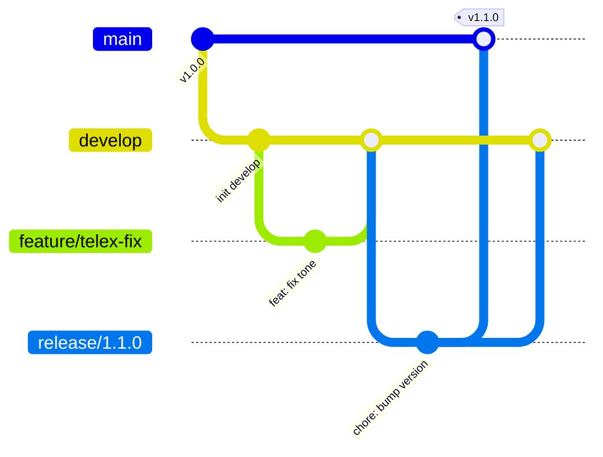

# GitFlow

Dự án **gotiengviet-js** áp dụng mô hình [GitFlow](https://nvie.com/posts/a-successful-git-branching-model/) với điều chỉnh: **feature branch được merge trực tiếp vào `develop` mà không bắt buộc tạo Pull Request**.

## Sơ đồ nhánh



## Các nhánh

| Nhánh | Mục đích | Tạo từ | Merge vào |
|-------|----------|--------|-----------|
| `main` | Production — code đã publish npm | — | — |
| `develop` | Tích hợp — tổng hợp feature đã hoàn thành | `main` (lần đầu) | — |
| `feature/*` | Phát triển tính năng mới | `develop` | `develop` |
| `release/*` | Chuẩn bị phát hành (version bump, changelog) | `develop` | `main` + `develop` |
| `hotfix/*` | Sửa lỗi khẩn trên production | `main` | `main` + `develop` |

## Quy tắc đặt tên nhánh

```
feature/<mo-ta-ngan>     # feature/vni-uppercase-rules
release/<version>        # release/1.1.0
hotfix/<mo-ta-ngan>      # hotfix/tone-skip-edge-case
```

Dùng chữ thường, phân tách bằng dấu gạch ngang. Ví dụ tốt: `feature/contenteditable-support`.

## Chính sách merge

### Feature → develop (không cần PR)

Được phép merge trực tiếp sau khi quality gate pass locally:

```bash
git checkout develop
git pull origin develop
git merge --no-ff feature/ten-tinh-nang
git push origin develop
```

- Dùng `--no-ff` để giữ lịch sử nhánh feature rõ ràng
- **Không bắt buộc** mở Pull Request để review
- Vẫn phải chạy `npm run lint`, `npm test`, `npm run build` trước khi merge

### Release → main + develop

```bash
git checkout main
git merge --no-ff release/1.1.0
git tag v1.1.0
git push origin main --tags

git checkout develop
git merge --no-ff release/1.1.0
git push origin develop
```

Chi tiết: [build-and-release.md](./build-and-release.md).

### Hotfix → main + develop

```bash
git checkout main
git merge --no-ff hotfix/ten-loi
git tag v1.0.1
git push origin main --tags

git checkout develop
git merge --no-ff hotfix/ten-loi
git push origin develop
```

## Khởi tạo nhánh develop (lần đầu)

Repository hiện có `main`. Tạo `develop` một lần:

```bash
git checkout main
git pull origin main
git checkout -b develop
git push -u origin develop
```

Sau đó mọi feature branch tạo từ `develop`.

## Commit message

Tuân theo [Conventional Commits](https://www.conventionalcommits.org/):

```
feat: them rule bo go moi
fix: sua loi dau thanh khi composing
docs: cap nhat gitflow
test: them test cho markRules uppercase
chore: cap nhat dependency
```

## CI/CD

Workflow hiện tại (`.github/workflows/ci.yml`) chạy trên `main`. Khuyến nghị bổ sung `develop` vào trigger:

```yaml
on:
  push:
    branches: [ main, develop ]
  pull_request:
    branches: [ main, develop ]
```

Publish npm chỉ trigger từ tag `v*.*.*` trên `main` — không đổi.

## Khi nào dùng nhánh nào?

| Tình huống | Nhánh |
|------------|-------|
| Tính năng mới | `feature/*` từ `develop` |
| Sửa lỗi trong quá trình phát triển | `feature/*` hoặc `fix/*` từ `develop` |
| Chuẩn bị release npm | `release/*` từ `develop` |
| Sửa lỗi production khẩn | `hotfix/*` từ `main` |

## Tài liệu liên quan

- [Workflow feature](./feature-workflow.md) — quy trình implement từng bước
- [Đóng góp](./contributing.md) — quy tắc chung
- [Build & Phát hành](./build-and-release.md) — release và tag
