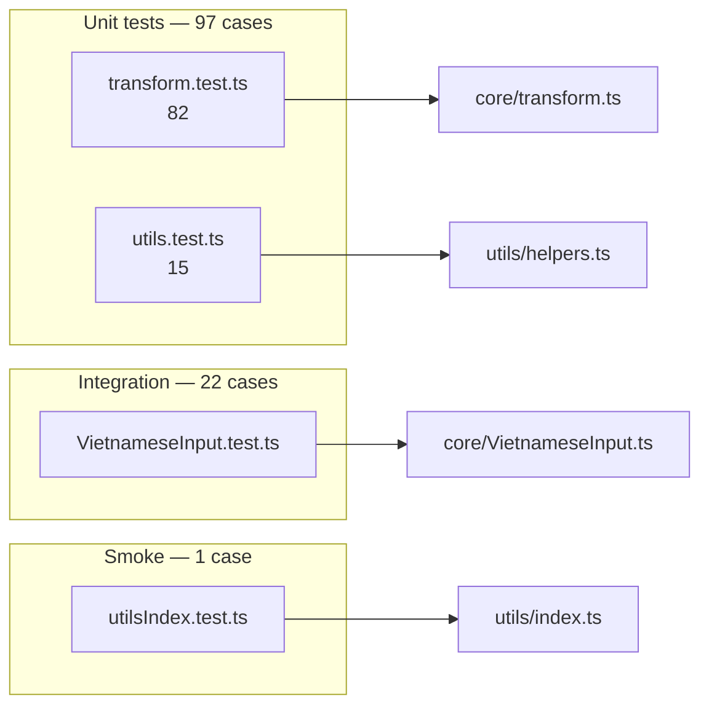

# Kịch bản kiểm thử (Test Scenarios)

Tài liệu này liệt kê **toàn bộ 120 kịch bản test** hiện có trong dự án, nhóm theo file và `describe` block. Mỗi kịch bản ghi rõ **đầu vào**, **kết quả mong đợi** và **mục đích kiểm tra**.

Xem thêm: [Kiểm thử](./testing.md) (chiến lược, cấu hình Jest, coverage).

## Tổng quan

| File | Số kịch bản | Loại | Module được test |
|------|-------------|------|------------------|
| `src/__tests__/transform.test.ts` | 82 | Unit | `processInputByMethod`, `applyToneToText` |
| `src/__tests__/utils.test.ts` | 15 | Unit | `helpers.ts` |
| `src/__tests__/VietnameseInput.test.ts` | 22 | Integration | `VietnameseInput` + DOM |
| `src/__tests__/utilsIndex.test.ts` | 1 | Smoke | Re-export `utils/index.ts` |
| **Tổng** | **120** | | |

---

## 1. `transform.test.ts` — Logic chuyển đổi thuần (82)

### 1.1 `applyToneToText` — Gán dấu thanh trực tiếp (8 kịch bản)

Hàm pure: nhận chuỗi + chỉ số tone (0–5), trả về chuỗi đã gán dấu.

| # | Kịch bản | Đầu vào | Kết quả | Mục đích |
|---|----------|---------|---------|----------|
| 1 | Không có nguyên âm | `applyToneToText('bc', 1)` | `'bc'` | Phụ âm thuần → không đổi |
| 1b | Chuỗi rỗng | `applyToneToText('', 1)` | `''` | Edge case rỗng |
| 2 | `y` là nguyên âm | `applyToneToText('xyz', 1)` | `'xýz'` | `y` nằm trong tập vowel |
| 3 | 5 dấu thanh trên `a` | `ma` + tone 1–5 | `má`, `mà`, `mả`, `mã`, `mạ` | Mapping đủ 5 tone |
| 4 | Tone 0 (ngang) | `ma` + 0 → `ma`; `má` + 0 → `má` | Giữ nguyên / không revert |
| 5 | Ưu tiên nguyên âm | `ban`+1 → `bán`; `hoa`+1 → `hoá` | `a` ưu tiên hơn `o` trong `hoa` |
| 6 | Chữ hoa hỗn hợp | `BAN`+1 → `BÁN`; `bAn`+2 → `bàn` | Case handling |
| 7 | Toàn chữ hoa | `HOA`+1 → `HOÁ` | Nhánh `isAllUpper` |
| 8 | Nguyên âm đặc biệt | `cây`+1, `tăng`+2, `tê`+3, `cô`+4, `mơ`+5, `tư`+1 | `cấy`, `tằng`, `tể`, `cỗ`, `mợ`, `tứ` | â, ă, ê, ô, ơ, ư |

### 1.2 Telex — Quy tắc mũ / đ (15 kịch bản)

| # | Đầu vào | Kết quả | Phím |
|---|---------|---------|------|
| 1 | `aa` | `â` | aa → â |
| 2 | `aw` | `ă` | aw → ă |
| 3 | `dd` | `đ` | dd → đ |
| 4 | `ee` | `ê` | ee → ê |
| 5 | `oo` | `ô` | oo → ô |
| 6 | `ow` | `ơ` | ow → ơ |
| 7 | `uw` | `ư` | uw → ư |
| 8 | `AA` | `Â` | Chữ hoa |
| 9 | `DD` | `Đ` | Chữ hoa |
| 10 | `EE` | `Ê` | Chữ hoa |
| 11 | `OO` | `Ô` | Chữ hoa |
| 12 | `AW` | `Ă` | Chữ hoa |
| 13 | `OW` | `Ơ` | Chữ hoa |
| 14 | `UW` | `Ư` | Chữ hoa |
| 15 | `tuow` → `tươ`; `HUOW` → `HƯƠ` | Chuẩn hóa `uơ` → `ươ` |

### 1.3 Telex — Quy tắc dấu thanh (12 kịch bản)

| # | Đầu vào | Kết quả | Phím tone |
|---|---------|---------|-----------|
| 1 | `as` | `á` | s = sắc |
| 2 | `af` | `à` | f = huyền |
| 3 | `bas` | `bá` | Có phụ âm đầu |
| 4 | `baf` | `bà` | |
| 5 | `bar` | `bả` | r = hỏi |
| 6 | `bax` | `bã` | x = ngã |
| 7 | `baj` | `bạ` | j = nặng |
| 8 | `hoas` | `hoá` | Đa nguyên âm — dấu trên `a` |
| 9 | `ddas` | `đá` | Mark + tone |
| 10 | `ddaf` | `đà` | Mark + tone |
| 11 | `basz` | `báz` | z = ngang (known: không xóa z) |
| 12 | `ass` | `ás` | s kép — s đầu gán tone |

### 1.4 Telex — Từ ghép / hành vi thực tế (3 kịch bản)

| # | Đầu vào | Kết quả | Ghi chú |
|---|---------|---------|---------|
| 1 | `tieengs` | `tieéng` | `ee` giữ nguyên, không thành `tiếng` |
| 2 | `vieetj` | `vieẹt` | Tone trên `e`, không gộp `ee` → `ê` |
| 3 | `nguoiwf` | `nguòiw` | Tone trên `o`, không thành `người` |

### 1.5 Telex — No-op (1 kịch bản)

| Đầu vào | Kết quả | Mục đích |
|---------|---------|----------|
| `abc`, `xi` | không đổi | Không khớp rule; `xi` không bị biến thành `ĩ` |

### 1.6 VNI — Quy tắc mũ / đ (9 kịch bản)

| Đầu vào | Kết quả | Phím |
|---------|---------|------|
| `a6` | `â` | 6 |
| `a8` | `ă` | 8 |
| `d9` | `đ` | 9 |
| `e6` | `ê` | 6 |
| `o6` | `ô` | 6 |
| `o7` | `ơ` | 7 |
| `u7` | `ư` | 7 |
| `A6` | `Â` | Hoa |
| `D9` | `Đ` | Hoa |

### 1.7 VNI — Quy tắc dấu thanh (8 kịch bản)

| Đầu vào | Kết quả | Phím |
|---------|---------|------|
| `ba1` | `bá` | 1 = sắc |
| `ba2` | `bà` | 2 = huyền |
| `ba3` | `bả` | 3 = hỏi |
| `ba4` | `bã` | 4 = ngã |
| `ba5` | `bạ` | 5 = nặng |
| `hoa1` | `hoá` | Đa nguyên âm |
| `ba10` | `bá0` | Tone trên `ba`, số `0` còn lại |
| `dd1` | `dd1` | **Known:** cần `d9` trước, không tự `đ` |

### 1.8 VNI — Từ ghép (1 kịch bản, 2 assert)

| Đầu vào | Kết quả |
|---------|---------|
| `tieeng5` | `tieẹng` |
| `vieetj5` | `vieẹtj` |

### 1.9 VIQR — Mũ / đ (không xung đột `^`) — 8 kịch bản

| Đầu vào | Kết quả | Phím |
|---------|---------|------|
| `a(` | `ă` | ( |
| `dd` | `đ` | dd |
| `o+` | `ơ` | + |
| `u+` | `ư` | + |
| `A(` | `Ă` | Hoa |
| `DD` | `Đ` | Hoa |
| `O+` | `Ơ` | Hoa |
| `U+` | `Ư` | Hoa |

### 1.10 VIQR — Xung đột `^` (tone vs mũ) — 1 kịch bản

| Đầu vào | Kết quả | Ghi chú |
|---------|---------|---------|
| `a^`, `e^`, `o^` | `a`, `e`, `o` | `^` bị xử lý như tone revert, không tạo â/ê/ô |

### 1.11 VIQR — Dấu thanh (8 kịch bản)

Tone key **bị loại** khỏi chuỗi; phụ âm sau nguyên âm **được giữ**.

| Đầu vào | Kết quả | Phím |
|---------|---------|------|
| `as'` | `ás` | ' = sắc |
| ``af` `` | `àf` | backtick = huyền |
| `ar?` | `ảr` | ? = hỏi |
| `ax~` | `ãx` | ~ = ngã |
| `aj.` | `ạj` | . = nặng |
| `hoas'` | `hoás` | Đa nguyên âm |
| `a'` | `á` | Tone ngay sau vowel — hoạt động |
| ``a` `` | `à` | backtick sau vowel |

### 1.12 VIQR — Tone trước nguyên âm — không hỗ trợ (3 kịch bản)

| Đầu vào | Kết quả | Ghi chú |
|---------|---------|---------|
| `b'a` | `b'a` | Cần `a'` thay vì `b'a` |
| ``b`a`` | ``b`a`` | Tone trước vowel |
| `b?a` | `b?a` | |

### 1.13 VIQR — Từ ghép (1 kịch bản, 2 assert)

| Đầu vào | Kết quả |
|---------|---------|
| `tieeng'` | `tieéng` |
| `vieetj.` | `vieẹtj` |

### 1.14 Edge cases chung (4 kịch bản)

| # | Đầu vào | Kết quả | Mục đích |
|---|---------|---------|----------|
| 1 | `axx` (Telex) | `ãx` | Bỏ qua tone key trùng liên tiếp (`xx`) |
| 2 | `aâ` (Telex) | `aâ` | Mũ đã có — không ghi đè |
| 3 | `MIFNH` (Telex) | `MÌNH` | Viết tắt / chữ hoa đặc biệt |
| 4 | `huowng` → `hương`; `HUOWNG` → `HƯƠNG` | Chuỗi ow + normalize ươ |

---

## 2. `utils.test.ts` — Helper functions (15)

### 2.1 `isVietnameseWord` (3 kịch bản)

| Kịch bản | Đầu vào | Kết quả |
|----------|---------|---------|
| Rỗng / ký tự đặc biệt | `''`, `'!@#$%^&*()'` | `false` |
| Tiếng Việt hợp lệ | `'Tiếng Việt'`, `'Nguyen'`, `'Đặng Thái Sơn'`, `'Trần'` | `true` |
| Không phải tiếng Việt | `'hello123'`, `'test@domain.com'`, `'https://abc.com'`, `'code_snippet'` | `false` |

### 2.2 `getLastWord` (2 kịch bản)

| Kịch bản | Đầu vào `(value, cursor)` | Kết quả |
|----------|---------------------------|---------|
| Từ trước con trỏ | `('Xin chao cac ban', 17)` → `'ban'`; `(..., 12)` → `'cac'`; `('Xin chao', 8)` → `'chao'`; `('Xin', 3)` → `'Xin'` | Lấy đúng từ cuối |
| Không có từ | `('   ', 3)`, `('', 0)` | `''` |

### 2.3 `findVowelPosition` (2 kịch bản)

| Kịch bản | Đầu vào | Kết quả |
|----------|---------|---------|
| Vị trí nguyên âm ASCII | `'TiengViet'` → `[1,2,6,7]`; `'abc'` → `[0]`; `'xyz'` → `[1]`; `''` → `[]` | |
| Nguyên âm có dấu mũ | `'ươuăâêôơư'` → `[0..8]` | |

### 2.4 `shouldRestoreNonViet` (4 kịch bản)

| Kịch bản | Đầu vào | Kết quả | Ý nghĩa |
|----------|---------|---------|---------|
| Email | `'test@email.com'` | `true` | Không sửa email |
| URL | `'https://...'`, `'http://...'` | `true` | Không sửa URL |
| Biến / mã | `'variableName'`, `'test123'`, `'a'` | `true` | Giống identifier |
| Tiếng Việt | `'Tiếng Việt'`, `'Xin chao'` | `false` | Cho phép transform |

### 2.5 `replaceText` (4 kịch bản)

| # | Kịch bản | Thiết lập | Kết quả mong đợi |
|---|----------|-----------|------------------|
| 1 | `<input>` thay đoạn giữa | value `'Xin chao cac ban'`, thay `[8,11)` → `'bạn'` | value `'Xin chaobạnc ban'`, caret `11` |
| 2 | `<textarea>` chèn đầu | thay `[0,0)` → `'Chào '` | value `'Chào Xin chao cac ban'`, caret `5` |
| 3 | Khôi phục scroll | `scrollTop = 42` trước/sau replace | `scrollTop` vẫn `42` |
| 4 | Fallback không có `setRangeText` | Mock object không có API | Splice thủ công, caret đúng |

---

## 3. `VietnameseInput.test.ts` — Integration (22)

### 3.1 Singleton lifecycle (2 kịch bản)

| Kịch bản | Hành vi | Assert |
|----------|---------|--------|
| Cùng instance | `getInstance()` hai lần | Cùng tham chiếu object |
| Destroy & recreate | `destroyInstance()` rồi `getInstance()` | Instance mới, khác tham chiếu |

### 3.2 Cấu hình mặc định (1 kịch bản)

| Kịch bản | Assert |
|----------|--------|
| `getInstance()` không config | `enabled === true`, `inputMethod === 'telex'` |

### 3.3 API cấu hình (2 kịch bản)

| Kịch bản | Hành vi | Assert |
|----------|---------|--------|
| enable / disable / toggle | Chuỗi `false → enable → disable → toggle` | `isEnabled()` khớp từng bước |
| setInputMethod | `vni → telex → viqr`; gọi `'invalid'` | Giữ `viqr`, không đổi khi invalid |

### 3.4 Composition events (1 kịch bản)

| Kịch bản | Assert |
|----------|--------|
| `handleCompositionStart` / `End` | `composing`: `false → true → false` |

### 3.5 `handleInput` — Điều kiện bỏ qua (2 kịch bản)

| Kịch bản | Thiết lập | Mục đích |
|----------|-----------|----------|
| Disabled hoặc composing | `disable()` hoặc `composing = true` | Không transform |
| `lastWord.length < 2` | `value = 'a'` | Chỉ xử lý từ ≥ 2 ký tự |

### 3.6 `handleInput` — Transform qua DOM (6 kịch bản)

| # | Bộ gõ | Input value | Sau xử lý | Rule |
|---|-------|-------------|-----------|------|
| 1 | Telex | `baaa` | `baâ` | `aa` → `â` |
| 2 | Telex | `baas` | `baá` | `s` → sắc |
| 3 | VNI | `xin hoa1` | `xin hoá` | `1` → sắc trên `a` |
| 4 | VIQR | `baaa(` | `baaă` | `a(` → `ă` |
| 5 | Telex | `hello` | `hello` | Không đổi (no rule) |
| 6 | Telex | `baas`, `selectionStart = null` | `baá` | Fallback `cursor = value.length` |

### 3.7 Delegate `processInput` / `applyTone` (5 kịch bản)

| Kịch bản | Gọi | Kết quả |
|----------|-----|---------|
| Không khớp rule | `processInput('abc', telex)` | `'abc'` |
| Không có vowel | `applyTone('bc', 1)` | `'bc'` |
| Không có toneMap | `applyTone('zzz', 1)` | `'zzz'` |
| Gán tone | `applyTone('ban', 1)` → `'bán'`; `applyTone('bAn', 2)` → `'bàn'` | |
| Mark hoa | `processInput('Dd')` / `('DD')` → `'Đ'` | |

### 3.8 Known behavior / regression (2 kịch bản)

| Đầu vào (Telex) | Kết quả | Ghi chú |
|-----------------|---------|---------|
| `MIFNH` | `MÌNH` | Viết tắt chữ hoa |
| `huowng`, `HUOWNG` | `hương`, `HƯƠNG` | ow + normalize |

### 3.9 Cleanup (1 kịch bản)

| Kịch bản | Assert |
|----------|--------|
| `destroy()` | `document.removeEventListener` được gọi |

---

## 4. `utilsIndex.test.ts` — Smoke (1)

| Kịch bản | Thiết lập | Kết quả |
|----------|-----------|---------|
| Re-export `replaceText` | Import từ `../utils`, thay `[6,11)` trong `'hello world'` → `'everyone'` | `'hello everyone'`, caret `14` |

Đảm bảo barrel export `utils/index.ts` không bị gãy.

---

## 5. Known limitations (tổng hợp)

Các kịch bản sau **cố ý** ghi nhận hành vi engine hiện tại, không phải lỗi test:

| Nhóm | Đầu vào | Kỳ vọng lý tưởng | Hành vi thực tế |
|------|---------|------------------|-----------------|
| Telex compound | `nguoiwf` | `người` | `nguòiw` |
| Telex compound | `tieengs` | `tiếng` | `tieéng` |
| Telex tone z | `basz` | `ba` | `báz` |
| VIQR tone vị trí | `b'a` | `bá` | không đổi |
| VIQR mũ | `a^` | `â` | `a` |
| VNI mark+tone | `dd1` | `đ` + tone | `dd1` |

## 6. Nhánh code chưa cover (không thêm test)

| Vị trí | Lý do |
|--------|-------|
| `transform.ts` L62, L81 | Mark revert khi kết quả đã có → **vòng lặp vô hạn** (`âaa`) |
| `transform.ts` L23–24 | Skip tone trùng — đã cover qua `axx` |
| `VietnameseInput.ts` L43, L90, L146 | Nhánh default config edge — coverage 85% branch |

## 7. Thêm kịch bản mới

| Thay đổi mã nguồn | File test | Hành động tài liệu |
|-------------------|-----------|-------------------|
| Quy tắc bộ gõ | `transform.test.ts` | Thêm hàng vào mục 1 tương ứng |
| Helper mới | `utils.test.ts` | Thêm mục 2.x |
| API / event mới | `VietnameseInput.test.ts` | Thêm mục 3.x |
| Export mới | `utilsIndex.test.ts` | Thêm mục 4 |

Sau khi thêm test, cập nhật **bảng tổng quan** ở đầu file này và mục tương ứng trong [testing.md](./testing.md).
